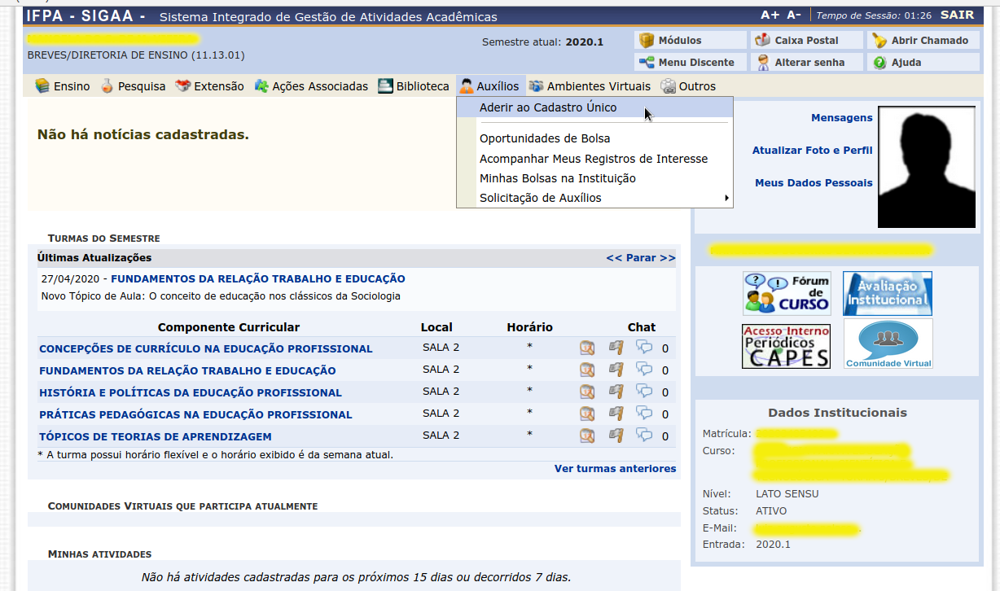
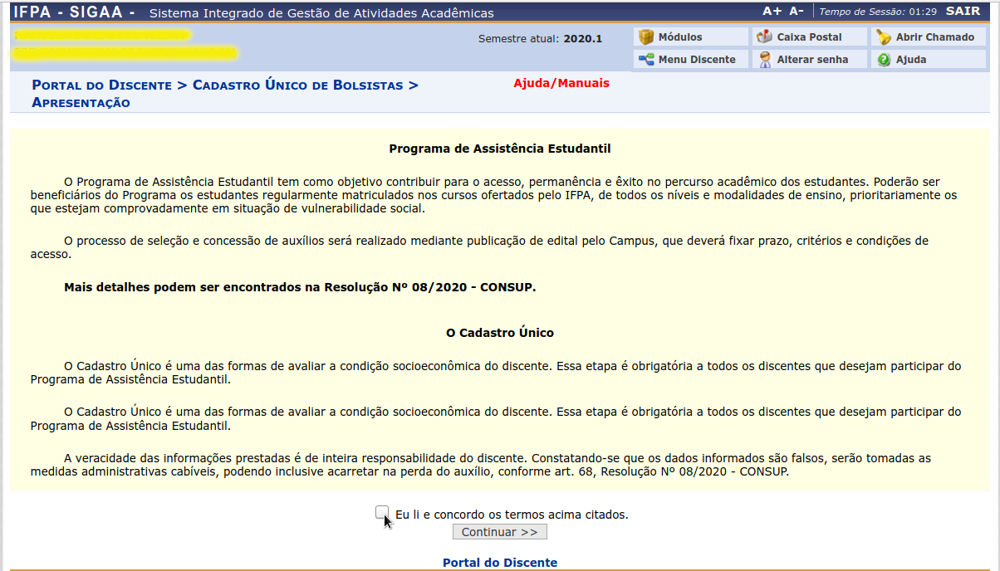

Solicitação de Auxílio Estudantil
=================================

O serviço de solicitação de auxílio estudantil está disponível, até o presente momento, apenas para
discentes do instituto.

Passos para utilização do serviço via gov.br
--------------------------------------------

Primeiramente o usuário deverá acessar o SIGAA [#]_ IFPA [#]_ (dependendo do ambiente, que pode ser o de produção ou homologação)
e clicar no botão de login do gov.br disponível na página inicial de acesso ao sistema.

.. figure:: _static/img/assistence/login-sigaa-govbr.png
    :align: center

    Página de login do SIGAA.

Após esse passo, o usuário é redirecionado para a página de login do gov.br, onde deverá entrar com suas credenciais
de acesso (CPF e senha), para efetuar seu login.

    Página de login do gov.br

.. note:: O usuário pode criar uma conta no gov.br caso não possua uma.

Em seguida, o usuário é redirecionado novamente para o SIGAA IFPA. Nesse momento, a rotina de login executa o procedimento
descrito na sessão :ref:`Casos de Uso <casos_de_uso>`.

Para solicitar auxílio estudantil, o usuário precisa preencher, ou ter preenchido, o formulário de adesão ao
cadastro único. Após logar no sistema, o usuário deverá clicar no item de menu *Aderir ao Cadastro único* na aba *Auxílios*
conforme imagem a seguir.

    Adesão ao cadastro único

.. note:: O login do usuário no sistema é feito automaticamente caso o mesmo possua vínculo de discente.

O usuário deverá ler e aceitar os termos de uso referente ao cadastro no Programa de Assistência Estudantil.

    Termos de uso do Programa de Assistência Estudantil

O usuário precisa informar suas informações de perfil antes de preencher o formulário de adesão.

.. rubric:: Notas

.. [#] Sistema Integrado de Gestão de Atividades Acadêmicas.
.. [#] Instituto Federal de Educação, Ciência e Tecnologia do Pará.