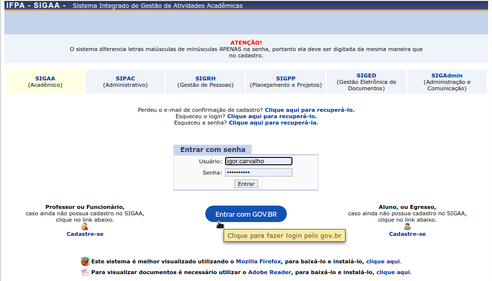

Solicitação de Auxílio Estudantil
=================================

O serviço de solicitação de auxílio estudantil está disponível, até o presente momento, apenas para
discentes do instituto.

Passos para utilização do serviço via gov.br
--------------------------------------------

Primeiramente o usuário deverá acessar o SIGAA [#]_ IFPA [#]_ (dependendo do ambiente, que pode ser o de produção ou homologação)
e clicar no botão de login do gov.br disponível na página inicial de acesso ao sistema.

    Página de login do SIGAA.

Após esse passo, o usuário é redirecionado para a página de login do gov.br, onde deverá entrar com suas credenciais
de acesso (CPF e senha), para efetuar seu login.

.. figure:: _static/img/assistence/login-govbr.png
    :align: center

    Página de login do gov.br

.. note:: O usuário pode criar uma conta no gov.br caso não possua uma.

Em seguida, o usuário é redirecionado novamente para o SIGAA IFPA. Nesse momento, a rotina de login executa o procedimento
descrito na sessão :hoverxref:`Casos de Uso <casos_de_uso>`.

Para solicitar auxílio estudantil, o usuário precisa preencher, ou ter preenchido, o formulário de adesão ao
cadastro único. Após logar no sistema, o usuário deverá clicar no item de menu *Aderir ao Cadastro único* na aba *Auxílios*
conforme imagem a seguir.

.. figure:: _static/img/assistence/aderir-cadastro-unico.png
    :align: center

    Adesão ao cadastro único

.. note:: O login do usuário no sistema é feito automaticamente caso o mesmo possua vínculo de discente.

O usuário deverá ler e aceitar os termos de uso referente ao cadastro no Programa de Assistência Estudantil.

.. figure:: _static/img/assistence/termos-uso.png
    :align: center

    Termos de uso do Programa de Assistência Estudantil

O usuário precisa informar suas informações de perfil antes de preencher o formulário de adesão.

.. figure:: _static/img/assistence/perfil.png
    :align: center

    Formulário do perfil de adesão

As informações submetidas pelo usuário via formulário de adesão são de fundamental importância para o Programa
de Assistência Estudantil.

    Início do questionário de adesão

    Final do questionário de adesão

O usuário pode se inscrever em processos seletivos referentes a auxílios estudantis após finalizar o preenchimento
do questionario de adesão ao Programa de Assistência Estudantil.

    Questionário de adesão submetido com sucesso.

Para se inscrever em um processo seletivo referente a auxílios estudantis, primeiramente o usuário deverá acessar
o formulário de solicitação de bolsa.

    Solicitar auxílio

O usuário poderá verificar quais processos seletivos estão vigentes, bem como os respectivos cronogramas de acompanhamento
e submissão.

    Formulário de solicitação de bolsa

O usuário preenche o formulário de requerimento com as informações necessárias e em seguida anexa os documentos
pertinentes ao seu requerimento.

    Formulário de justificativa de requerimento

    Tela de conclusão de solicitação e anexo de documentação

O usuário pode acompanhar sua solicitação acessando a página de acompanhamento de solicitações de auxílios

    Acompanhamento de solicitações

O *link* de avaliação de serviço fica disponível para o usuário acessar em função do *status* de sua solicitação.

    *Link* de avaliação

O usuário avalia o serviço utilizando a API de avaliação fornecida pelo gov.br

    Formulário de avaliação de serviços via API gov.br

.. rubric:: Notas

.. [#] Sistema Integrado de Gestão de Atividades Acadêmicas.
.. [#] Instituto Federal de Educação, Ciência e Tecnologia do Pará.