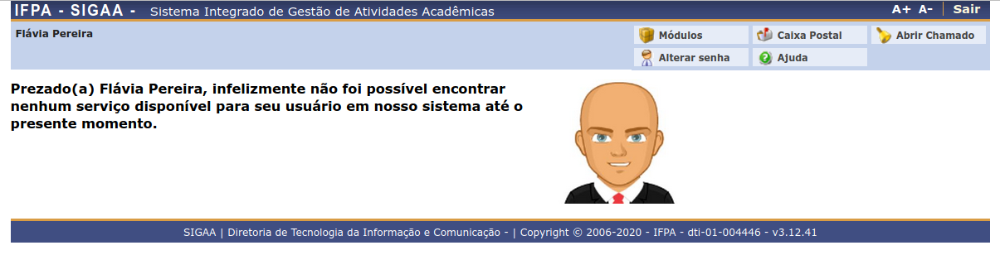

Introdução
==========

Neste primeiro momento de integração, foi definido pela direção que o serviço a ser disponibilizado
será o de obtenção de auxílio estudantil para discentes do IFPA [#]_ utilizando o login único
do gov.br.

Novos serviços serão disponibilizados conforme cronograma definido pela direção, utilizando como base a experiência
desse primeiro serviço implantado.

.. _casos_de_uso:

Casos de Uso
------------

Para o serviço de obtenção de auxílio estudantil foram utilizados como base os três tipo de usuários a seguir,
todos baseando-se no CPF do usuário gov.br:

    1. O CPF do usuário gov.br está cadastrado na base de dados como usuário do SIGAA [#]_.
    2. O CPF do usuário gov.br está cadastrado na base de dados como discente do SIGAA, mas não como usuário.
    3. O CPF do usuário gov.br não está cadastrado na base de dados nem como discente, nem como usuário do SIGAA.

.. _primeiro_caso:

Primeiro caso
~~~~~~~~~~~~~

**O CPF do usuário gov.br está cadastrado na base de dados como usuário do SIGAA**: Nesse caso, após clicar
no botão "Login GOVBR" a partir do SIGAA IFPA, ser redirecionado para a página de login
do gov.br, efetuar seu login e em seguida ser redirecionado novamente para o SIGAA IFPA, o login no
SIGAA IFPA é efetuado via passaporte, logando automaticamente o usuário gov.br como usuário padrão SIGAA.

Segundo caso
~~~~~~~~~~~~

**O CPF do usuário gov.br está cadastrado na base de dados como discente do SIGAA, mas não como usuário**: Nesse caso,
o usuário gov.br, que já possui cadastro de discente no SIGAA IFPA, tem seu autocadastro de usuário SIGAA IFPA
feito automaticamente pela rotina de login. Em seguida, o login desse usuário é feito de acordo com :hoverxref:`caso anterior <primeiro_caso>`.

Terceiro caso
~~~~~~~~~~~~~

**O CPF do usuário gov.br não está cadastrado na base de dados nem como discente, nem como usuário do SIGAA**: Nesse caso,
o usuário gov.br é redirecionado para uma página intermediária, informando ao mesmo quaisquer informações
pertinentes.

    Tela intermediária

Protocolo
---------

A versão **inicial** do número de protoloco é uma *string* com o seguinte formato:

    [ano][mês][dia][hora][minuto][segundo].[código do serviço].[id do objeto na base]

Exemplo: 20210110093540.4295.32

.. note::
    
    Tanto o protocolo quanto o link de avaliação são adicionados ao objeto bolsa correspondente quando
    o status desse objeto é atualizado pelos gestores do serviço de auxílio.

.. rubric:: Notas

.. [#] Instituto Federal de Educação, Ciência e Tecnologia do Pará.
.. [#] Sistema Integrado de Gestão de Atividades Acadêmicas.